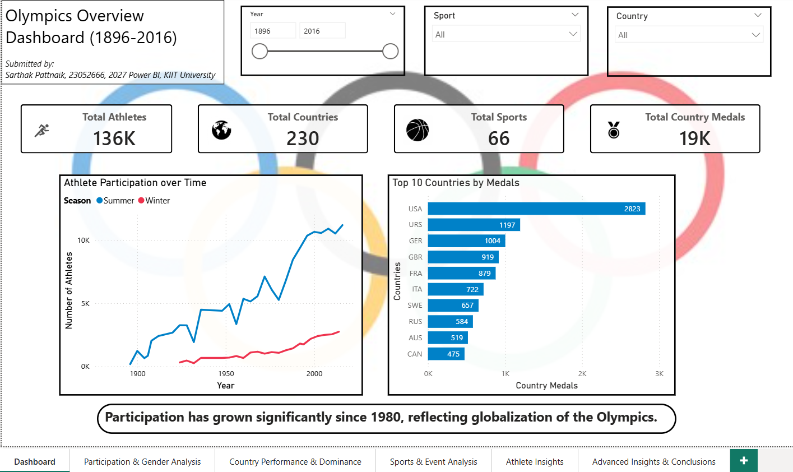
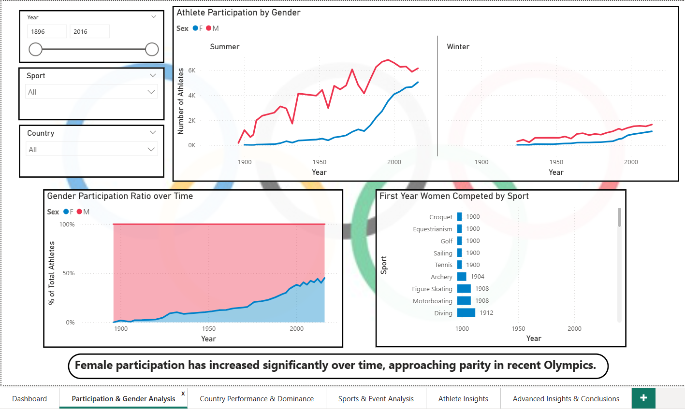
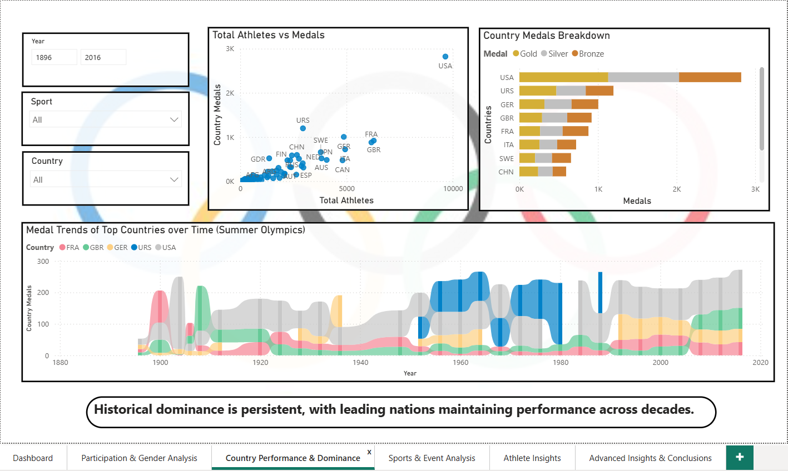
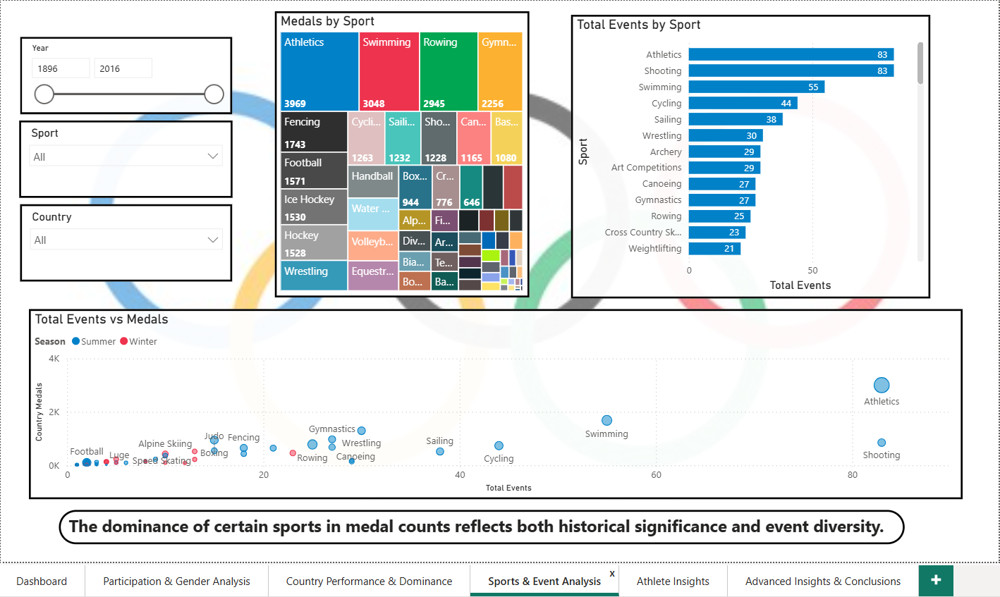
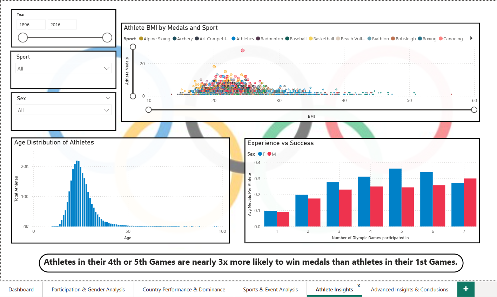
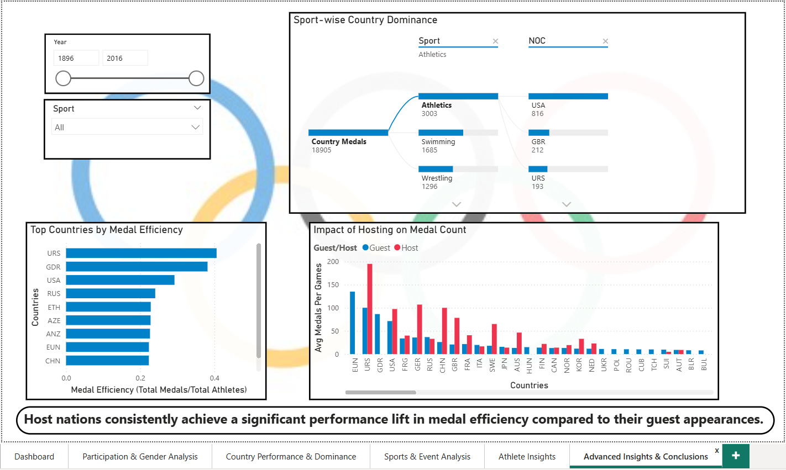

# 🏅 Olympics Analytics Dashboard (1896–2016)

## 📌 Overview

This project presents a comprehensive analysis of Olympic data from 1896 to 2016 using Power BI.

## 📊 Key Features

* Participation trends over time
* Gender equality analysis
* Country dominance and medal distribution
* Sports and event analysis
* Athlete performance insights

## 🛠️ Tech Stack

* Power BI

## 📸 Dashboard Preview

<h3>Page 1 – Dashboard</h3>

<h3>Page 2 – Participation & Gender Analysis</h3>

<h3>Page 3 - Country Performance & Dominance</h3>

<h3>Page 4 - Sports & Event Analysis</h3>

<h3>Page 5 - Athlete Insights</h3>

<h3>Page 6 - Advanced Insights & Conclusions</h3>

## 🚀 Key Insights

* Participation has grown significantly since 1980, reflecting globalization of the Olympics.
* Female participation has increased significantly over time, approaching parity in recent Olympics.
* Historical dominance is persistent, with leading nations maintaining performance across decades.
* The dominance of certain sports in medal counts reflects both historical significance and event diversity.
* Athletes in their 4th or 5th Games are nearly 3x more likely to win medals than athletes in their 1st Games.
* Host nations consistently achieve a significant performance lift in medal efficiency compared to their guest appearances.

## 📂 Files

* `Olympics_Data_Analysis_Capstone_Project.pbix` → Power BI dashboard
* `athlete_events.csv` → Dataset for Athlete Records
* `HostMapping.csv` -> Dataset for Host Cities
* `Project Documentation.pdf` -> Project Documentation
* `olympic_theme.json` -> Olympic theme colours
* `images/` → Folder for images used in report
* `screenshots/` -> Report screenshots